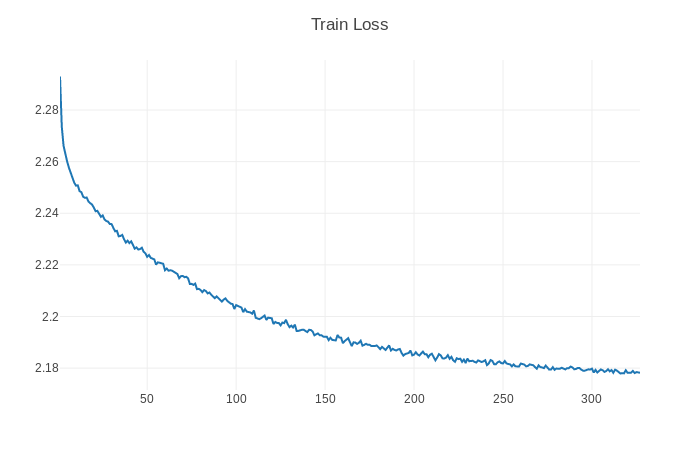
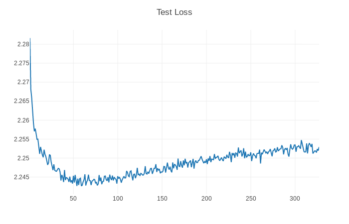
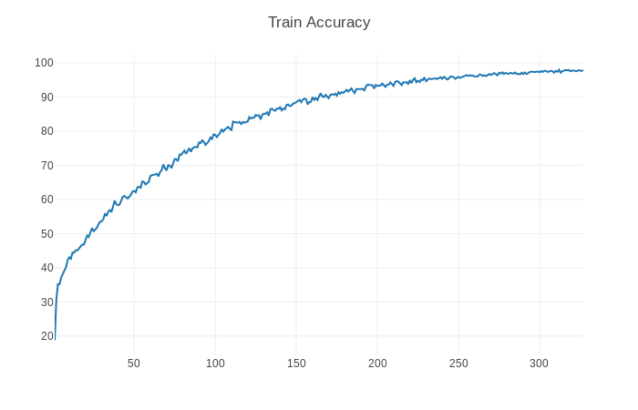
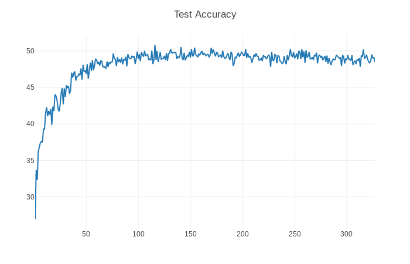
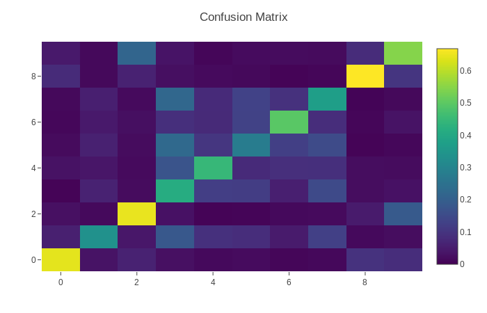

# CCN
Convolutional Capsule Network

## Requirements
* [Anaconda](https://www.anaconda.com/download/)
* PyTorch
```
conda install pytorch torchvision cuda90 -c pytorch
```
* PyTorchNet
```
pip install git+https://github.com/pytorch/tnt.git@master
```
* tqdm
```
pip install tqdm
```

## Usage
```
python -m visdom.server & python main.py
optional arguments:
--data_type                   dataset type [default value is 'MNIST'](choices:['MNIST', 'FashionMNIST', 'SVHN', 'CIFAR10', 'CIFAR100', 'STL10'])
--using_data_augmentation     is using data augmentation [default value is True]
--num_epochs                  train epochs number [default value is 100]
```
Visdom now can be accessed by going to `127.0.0.1:8097` in your browser, or your own host address if specified.

## Benchmarks(STL10)

Default PyTorch Adam optimizer hyperparameters were used with no learning 
rate scheduling. Epochs with batch size of 60 takes ~3 minutes on a NVIDIA GTX TiTAN GPU.

- Loss/Accuracy Graphs
<table>
  <tr>
    <td>
     
    </td>
    <td>
     
    </td>
  </tr>
</table>
<table>
  <tr>
    <td>
     
    </td>
    <td>
     
    </td>
  </tr>
</table>

- Confusion Matrix
 
