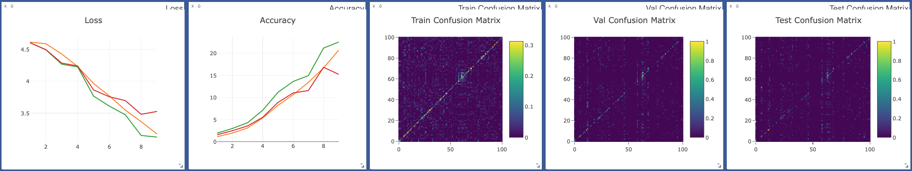
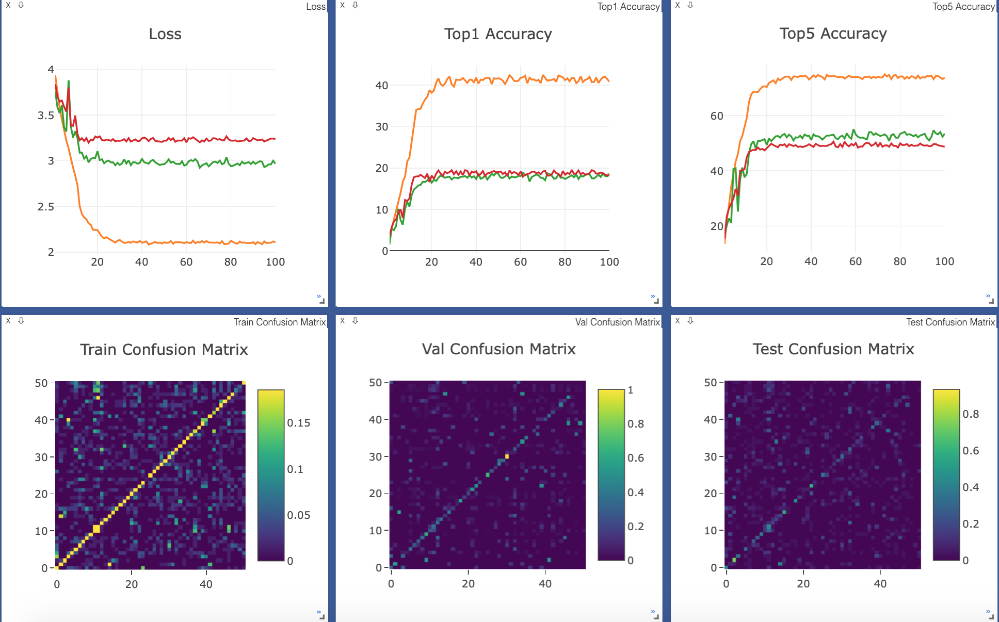
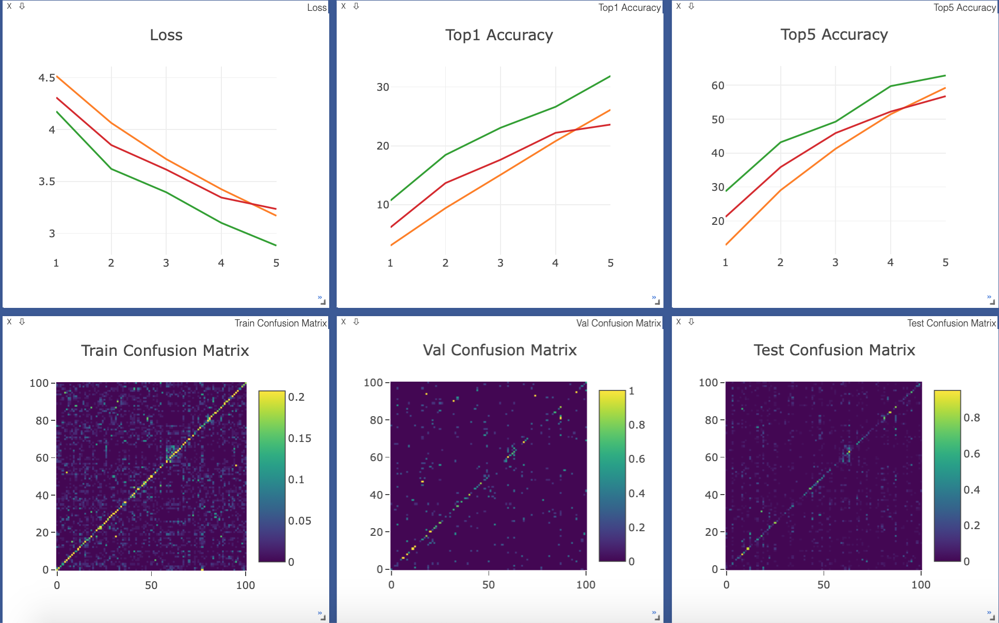

# Two-Stream STTS
A PyTorch implementation of Two-Stream Spatio-Temporal and Temporal-Spatio Convolutional Network based on the paper 
[Two-Stream Spatio-Temporal and Temporal-Spatio Convolutional Network for Activity Recognition]().

## Requirements
- [Anaconda](https://www.anaconda.com/download/)
- [PyTorch](https://pytorch.org)
```
conda install pytorch torchvision -c pytorch
```
- opencv
```
conda install opencv
```
- rarfile
```
pip install rarfile
```
- ffmpeg
```
sudo apt install build-essential openssl libssl-dev autoconf automake cmake git-core libass-dev libfreetype6-dev libsdl2-dev libtool libva-dev libvdpau-dev libvorbis-dev libxcb1-dev libxcb-shm0-dev libxcb-xfixes0-dev pkg-config texinfo wget zlib1g-dev nasm yasm libx264-dev libx265-dev libnuma-dev libvpx-dev libfdk-aac-dev libmp3lame-dev libopus-dev
wget https://ffmpeg.org/releases/ffmpeg-4.1.3.tar.bz2
tar -jxvf ffmpeg-4.1.3.tar.bz2
cd ffmpeg-4.1.3/
./configure --prefix="../build" --enable-static --enable-gpl --enable-libass --enable-libfdk-aac --enable-libfreetype --enable-libmp3lame --enable-libopus --enable-libvorbis --enable-libvpx --enable-libx264 --enable-libx265 --enable-nonfree --enable-openssl
make -j4
make install
sudo cp ../build/bin/ffmpeg /usr/local/bin/ 
rm -rf ../ffmpeg-4.1.3/ ../ffmpeg-4.1.3.tar.bz2 ../build/
```
- youtube-dl
```
pip install youtube-dl
```
- joblib
```
pip install joblib
```
- PyTorchNet
```
pip install git+https://github.com/pytorch/tnt.git@master
```

## Datasets
The datasets are coming from [UCF101](http://crcv.ucf.edu/data/UCF101.php)、 
[HMDB51](http://serre-lab.clps.brown.edu/resource/hmdb-a-large-human-motion-database/)
and [KINETICS600](https://deepmind.com/research/open-source/open-source-datasets/kinetics/).
Download `UCF101` and `HMDB51` datasets with `train/val/test` split files into `data` directory.
We use the `split1` to split files. Run `misc.py` to preprocess these datasets.

For `KINETICS600` dataset, first download `train/val/test` split files into `data` directory, and 
then run `download.py` to download and preprocess this dataset.

## Usage
### Train Model
```
visdom -logging_level WARNING & python train.py --num_epochs 20 --pre_train kinetics600_st-ts-a.pth
optional arguments:
--data_type                   dataset type [default value is 'ucf101'](choices=['ucf101', 'hmdb51', 'kinetics600'])
--gpu_ids                     selected gpu [default value is '0,1,2']
--model_type                  model type [default value is 'st-ts-a'](choices=['st-ts-a', 'st-ts', 'st-a', 'st', 'ts-a', 'ts'])
--batch_size                  training batch size [default value is 36]
--num_epochs                  training epochs number [default value is 100]
--pre_train                   used pre-trained model epoch name [default value is None]
```
Visdom now can be accessed by going to `127.0.0.1:8097` in your browser.

### Inference Video
```
python inference.py --video_name data/ucf101/ApplyLipstick/v_ApplyLipstick_g04_c02.avi
optional arguments:
--data_type                   dataset type [default value is 'ucf101'](choices=['ucf101', 'hmdb51', 'kinetics600'])
--model_type                  model type [default value is 'st-ts-a'](choices=['st-ts-a', 'st-ts', 'st-a', 'st', 'ts-a', 'ts'])
--video_name                  test video name
--model_name                  model epoch name [default value is 'ucf101_st-ts-a.pth']
```
The inferences will show in a pop up window.

## Results
The train/val/test loss、accuracy and confusion matrix are showed on visdom. 
### UCF101

### HMDB51

### KINETICS600


