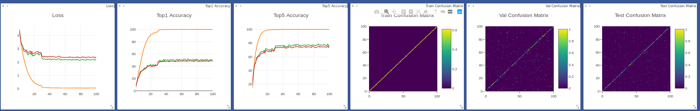
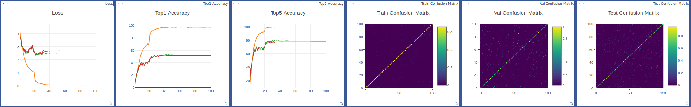
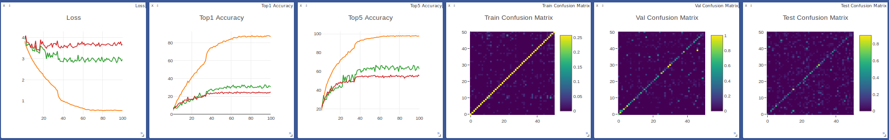
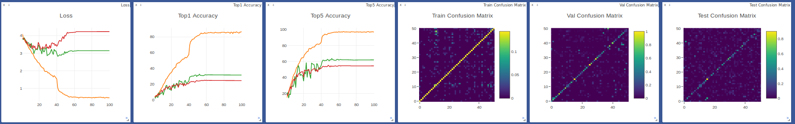

## R2Plus1D-C3D
A PyTorch implementation of R2Plus1D and C3D based on CVPR 2017
paper [A Closer Look at Spatiotemporal Convolutions for Action Recognition](https://arxiv.org/abs/1711.11248)
and CVPR 2014 paper [Learning Spatiotemporal Features with 3D Convolutional Networks](https://arxiv.org/abs/1412.0767).

## Requirements
- [Anaconda](https://www.anaconda.com/download/)
- [PyTorch](https://pytorch.org)
```
conda install pytorch torchvision -c pytorch
```
- opencv
```
conda install opencv
```
- rarfile
```
pip install rarfile
```
- rar
```
sudo apt install rar
```
- unrar
```
sudo apt install unrar
```
- ffmpeg
```
sudo apt install build-essential openssl libssl-dev autoconf automake cmake git-core libass-dev libfreetype6-dev libsdl2-dev libtool libva-dev libvdpau-dev libvorbis-dev libxcb1-dev libxcb-shm0-dev libxcb-xfixes0-dev pkg-config texinfo wget zlib1g-dev nasm yasm libx264-dev libx265-dev libnuma-dev libvpx-dev libfdk-aac-dev libmp3lame-dev libopus-dev
wget https://ffmpeg.org/releases/ffmpeg-4.1.3.tar.bz2
tar -jxvf ffmpeg-4.1.3.tar.bz2
cd ffmpeg-4.1.3/
./configure --prefix="../build" --enable-static --enable-gpl --enable-libass --enable-libfdk-aac --enable-libfreetype --enable-libmp3lame --enable-libopus --enable-libvorbis --enable-libvpx --enable-libx264 --enable-libx265 --enable-nonfree --enable-openssl
make -j4
make install
sudo cp ../build/bin/ffmpeg /usr/local/bin/ 
rm -rf ../ffmpeg-4.1.3/ ../ffmpeg-4.1.3.tar.bz2 ../build/
```
- youtube-dl
```
pip install youtube-dl
```
- joblib
```
pip install joblib
```
- PyTorchNet
```
pip install git+https://github.com/pytorch/tnt.git@master
```

## Datasets
The datasets are coming from [UCF101](http://crcv.ucf.edu/data/UCF101.php)、 
[HMDB51](http://serre-lab.clps.brown.edu/resource/hmdb-a-large-human-motion-database/)
and [KINETICS600](https://deepmind.com/research/open-source/open-source-datasets/kinetics/).
Download `UCF101` and `HMDB51` datasets with `train/val/test` split files into `data` directory.
We use the `split1` to split files. Run `misc.py` to preprocess these datasets.

For `KINETICS600` dataset, first download `train/val/test` split files into `data` directory, then 
run `download.py` to download and preprocess this dataset.

## Usage
### Train Model
```
visdom -logging_level WARNING & python train.py --num_epochs 20 --pre_train kinetics600_r2plus1d.pth
optional arguments:
--data_type                   dataset type [default value is 'ucf101'](choices=['ucf101', 'hmdb51', 'kinetics600'])
--gpu_ids                     selected gpu [default value is '0,1']
--model_type                  model type [default value is 'r2plus1d'](choices=['r2plus1d', 'c3d'])
--batch_size                  training batch size [default value is 8]
--num_epochs                  training epochs number [default value is 100]
--pre_train                   used pre-trained model epoch name [default value is None]
```
Visdom now can be accessed by going to `127.0.0.1:8097` in your browser.

### Inference Video
```
python inference.py --video_name data/ucf101/ApplyLipstick/v_ApplyLipstick_g04_c02.avi
optional arguments:
--data_type                   dataset type [default value is 'ucf101'](choices=['ucf101', 'hmdb51', 'kinetics600'])
--model_type                  model type [default value is 'r2plus1d'](choices=['r2plus1d', 'c3d'])
--video_name                  test video name
--model_name                  model epoch name [default value is 'ucf101_r2plus1d.pth']
```
The inferences will show in a pop up window.

## Benchmarks
Adam optimizer (lr=0.0001) is used with learning rate scheduling. 

For `ucf101` and `hmdb51` dataset, the models are trained with 100 epochs and 
batch size of 8 on one NVIDIA Tesla V100 (32G) GPU. 

For `kinetics600` dataset, the models are trained with 100 epochs and 
batch size of 32 on two NVIDIA Tesla V100 (32G) GPU. Because the training time
is too long, so this experiment have not been finished.

The videos are preprocessed as 32 frames of 128x128, and cropped to 112x112.

<table>
  <thead>
    <tr>
      <th>Dataset</th>
      <th>UCF101</th>
      <th>HMDB51</th>
      <th>Kinetics600</th>
    </tr>
  </thead>
  <tbody>
    <tr>
      <td align="center">Num. of Train Videos</td>
      <td align="center">9,537</td>
      <td align="center">3,570</td>
      <td align="center">375,008</td>
    </tr>
    <tr>
      <td align="center">Num. of Val Videos</td>
      <td align="center">756</td>
      <td align="center">1,666</td>
      <td align="center">28,638</td>
    </tr>
    <tr>
      <td align="center">Num. of Test Videos</td>
      <td align="center">3,783</td>
      <td align="center">1,530</td>
      <td align="center">56,982</td>
    </tr>
    <tr>
      <td align="center">Num. of Classes</td>
      <td align="center">101</td>
      <td align="center">51</td>
      <td align="center">600</td>
    </tr>
    <tr>
      <td align="center">Accuracy (R2Plus1D)</td>
      <td align="center"><b>63.60%</b></td>
      <td align="center">24.97%</td>
      <td align="center">\</td>
    </tr>
    <tr>
      <td align="center">Accuracy (C3D)</td>
      <td align="center">51.63%</td>
      <td align="center"><b>25.10%</b></td>
      <td align="center">\</td>
    </tr>
    <tr>
      <td align="center">Num. of Parameters (R2Plus1D)</td>
      <td align="center">33,220,990</td>
      <td align="center">33,195,340</td>
      <td align="center">33,476,977</td>
    </tr>
    <tr>
      <td align="center">Num. of Parameters (C3D)</td>
      <td align="center">78,409,573</td>
      <td align="center">78,204,723</td>
      <td align="center">80,453,976</td>
    </tr>
    <tr>
      <td align="center">Training Time (R2Plus1D)</td>
      <td align="center">19.3h</td>
      <td align="center">7.3h</td>
      <td align="center">350h</td>
    </tr>
    <tr>
      <td align="center">Training Time (C3D)</td>
      <td align="center">10.9h</td>
      <td align="center">4.1h</td>
      <td align="center">190h</td>
    </tr>
  </tbody>
</table>

## Results
The train/val/test loss、accuracy and confusion matrix are showed on visdom. 
The pretrained models can be downloaded from [BaiduYun](https://pan.baidu.com/s/1uz-g1HEehY5uziycbXNC8A)
(access code: ducr).

### UCF101
**R2Plus1D**

**C3D** 


### HMDB51
**R2Plus1D**

**C3D** 


